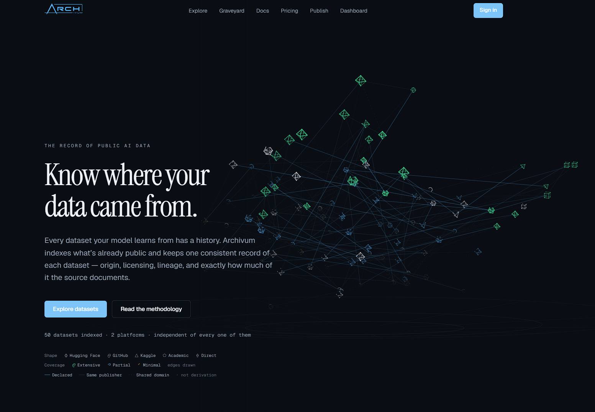

<p align="center">
  <a href="https://archivum.tech">
    
  </a>
</p>

<p align="center">
  <strong>The record of public AI data</strong><br />
  One consistent passport per public dataset — origin, licensing, lineage, and Documentation Coverage.
</p>

<p align="center">
  <a href="https://archivum.tech"><strong>Live site → archivum.tech</strong></a>
  ·
  <a href="./README-BACKEND.md">Backend &amp; ops</a>
  ·
  <a href="mailto:business@archivum.tech">Contact</a>
</p>

<p align="center">
  <a href="https://archivum.tech">
    
  </a>
</p>

---

# Archivum

Archivum is a catalog of **public AI datasets**. Instead of hunting across Hugging Face, GitHub, and academic hosts for scraps of provenance, you get one structured record per dataset: where it came from, how it is licensed, how it has changed, and how much of that story the source actually documents.

It is built by **Archivum LLC**. Metadata only — Archivum never hosts or redistributes dataset contents. Downloads always happen at the origin, under the origin’s terms.

## Why two README files?

| File | Audience | Purpose |
| --- | --- | --- |
| **[README.md](./README.md)** (this file) | Anyone opening the repo | What the product is, how the app works, local develop, what’s next |
| **[README-BACKEND.md](./README-BACKEND.md)** | Operators / deployers | Supabase, env vars, Vercel, first import, cron, coverage ops |

They are both needed: the root README is the product front door; the backend README is the runbook so ops detail does not bury the product story.

## What it does

- **Catalog** — Search and filter public datasets across supported platforms
- **Passport** — Origin, contributors, licensing, structure, and lineage on one page
- **Documentation Coverage** — Score of how much provenance the *source* documents (28 checks → four sections: origin, licensing, composition, maintenance). A measure of the **record**, never a grade of the dataset
- **Lineage** — Transformations and parent relationships as stated at the source
- **Corrections** — Anyone can flag a bad field; admins review in `/admin`
- **Daily re-check** — Published datasets are re-checked on a schedule; licence and metadata drift become version history

## How it works

```text
Sources (HF / GitHub / …)
        │  metadata only (+ optional truncated preview rows)
        ▼
  Ingest API (service role)
        │  coverage rules in src/lib/coverage/rules.ts
        ▼
     Supabase
   (RLS: public reads of published rows)
        │
        ▼
  Next.js App Router site
  (explore · dataset pages · docs · dashboard · admin)
```

1. **Import** — An admin pulls a dataset identifier through `/admin`. The importer fetches platform metadata, runs the 28 coverage checks, and lands a **draft**.
2. **Review & publish** — Drafts become public catalog entries when published.
3. **Browse** — Visitors explore without an account. Signed-in users can save datasets and use the dashboard.
4. **Refresh** — Vercel Cron hits `/api/cron/refresh` daily and re-checks the least-recently-checked published set.

With no Supabase env configured (or `NEXT_PUBLIC_DATA_SOURCE=mock`), the site runs against a **built-in demo catalog** so UI work does not block on the database.

## Stack

- **Next.js** (App Router, server-rendered) + React + Tailwind
- **Supabase** (Postgres, Auth, Row Level Security)
- **Vercel** (hosting + cron)
- **Zod** for request/schema validation; **Framer Motion** for motion on the marketing surface

## Repository layout

```text
src/          Next.js application (pages, API routes, components, coverage & ingest libs)
supabase/     SQL migrations applied to the live project
public/       Static assets (logos, favicons)
scripts/      Utility scripts
README.md     Product overview (this file)
README-BACKEND.md   Deploy, env, import, and operations
```

## Develop locally

```bash
npm install
cp .env.example .env.local   # optional — omit for mock mode
npm run dev
```

Open [http://localhost:3000](http://localhost:3000).

Useful routes:

| Path | Purpose |
| --- | --- |
| `/` | Marketing / atlas home |
| `/explore` | Catalog search |
| `/datasets/[slug]` | Dataset passport |
| `/docs` | Methodology & API notes |
| `/dashboard` | Signed-in saves / activity |
| `/admin` | Import, publish, corrections (admin emails only) |

Full environment variable reference, first-import checklist, and cron setup live in **[README-BACKEND.md](./README-BACKEND.md)**.

## What’s next

Near-term product and ops work:

- [ ] Wire waitlist / publish interest forms to a real endpoint (currently stubbed success UI)
- [ ] Replace placeholder domains (`archivum.example`) in `sitemap.ts` / `robots.ts` with the production host
- [ ] Expand source coverage beyond the current Hugging Face / GitHub metadata paths
- [ ] Ship Team / Enterprise billing (pricing UI exists; no Stripe or checkout yet)
- [ ] Harden production: paid Vercel if commercial, Supabase backups before real traffic

## Contact

- Product / business: [business@archivum.tech](mailto:business@archivum.tech)
- Live site: [archivum.tech](https://archivum.tech)

© Archivum LLC
